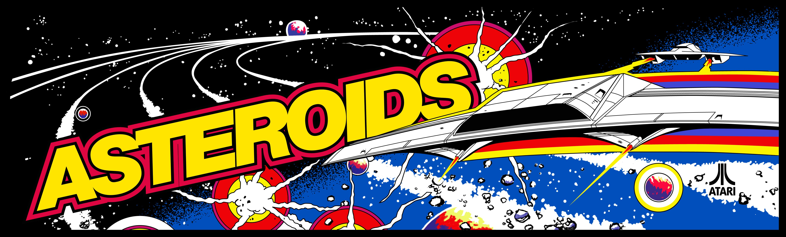

# Asteroids!
For my second milestone project, I have deciced to put my JavaScript knowledge to the test and create my version of my version of the classic 1979 classic Atari game, Asteroids. Built using HTML5, CSS3 and JavaScript.

# A Bit Of Info On The Game
Asteroids is a space-themed multidirectional shooter arcade game designed by Lyle Rains, Ed Logg, and Dominic Walsh and released in November 1979 by Atari, Inc. The player controls a single spaceship in an asteroid field which is periodically traversed by flying saucers. The object of the game is to shoot and destroy the asteroids and saucers, while not colliding with either, or being hit by the saucers' counter-fire. The game becomes harder as the number of asteroids increases.

Asteroids was one of the first major hits of the golden age of arcade games; the game sold over 70,000 arcade cabinets and proved both popular with players and influential with developers. In the 1980s it was ported to Atari's home systems, and the Atari VCS version sold over three million copies. The game was widely imitated, and it directly influenced Defender, Gravitar, and many other video games.

Asteroids was conceived during a meeting between Logg and Rains, who decided to use hardware developed by Howard Delman previously used for Lunar Lander. Asteroids was based on an unfinished game titled Cosmos; its physics model, control scheme, and gameplay elements were derived from Spacewar!, Computer Space, and Space Invaders and refined through trial and error. The game is rendered on a vector display in a two-dimensional view that wraps around both screen axes.

The above text is taken from [Wikipedia](https://en.wikipedia.org/wiki/Asteroids_(video_game)).

___

# User Stories

* Asteroids target audience 6+

* As a user I expect to be excited to play 

* As a user I expect to have fun 

* As a user I expect to be intrigued 

* As a user I expect to find the navigation ease to use 

* As a user I expect there to be gameplay instructions 

* As a user I expect the game to be easily playable 

* As a user I expect the controls to be easily accessible 

* As a user I expect there to be a scoring feature

* As a user I expect my high score to be saved 

