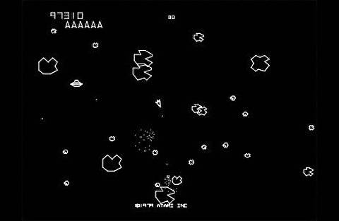
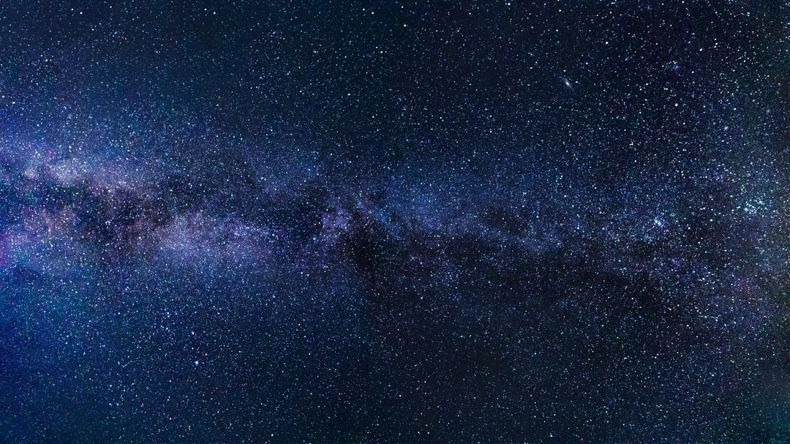
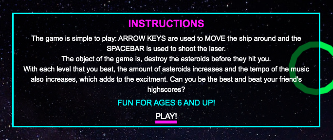
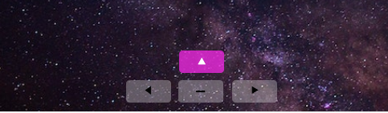
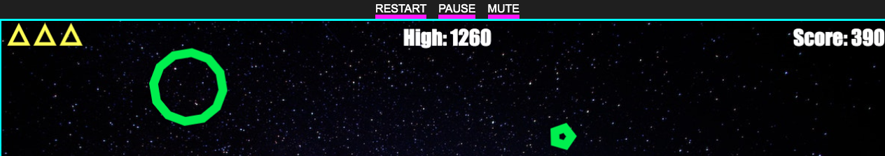
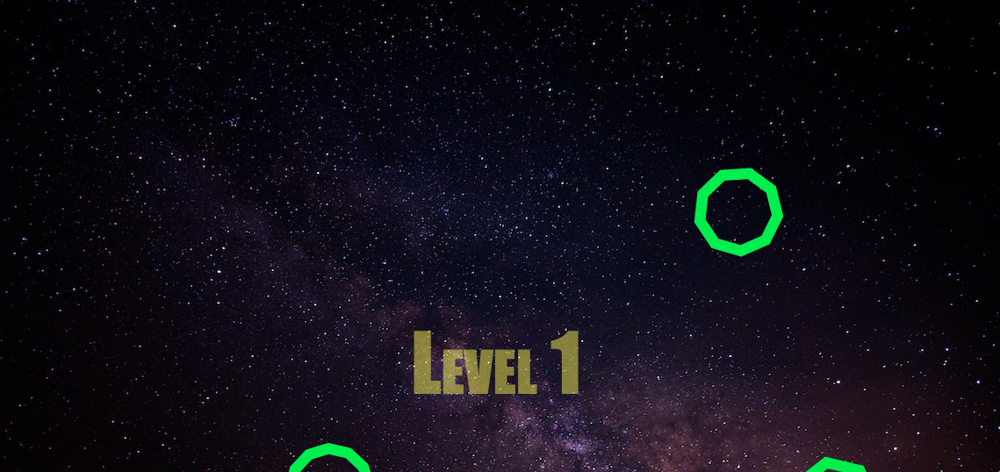

<small>Orginal Asteroid's promotional graphic design.</small>

# Asteroids!

## An Interactive Frontend Project by Michael McCann

For my second milestone project, I have deciced to put my JavaScript knowledge to the test and create my version of the classic 1979 classic Atari game, Asteroids. Built using HTML5, CSS3 and JavaScript. I aim to make the user experience more enjoyable for the gamer than its Daddy by giving the game an overhaul on the design.

For ages 6+

# Contents

- [A Bit Of Info On The Game](#a-bit-of-info-on-the-game)

- [The Strategy Plane](#the-strategy-plane)
- [The Scope Plane](#the-scope-plane)
- [The Structure Plane](#the-structure-plane)
- [The Skeleton Plane](#the-skeleton-plane)
- [User Experience](#user-experience)
- [Design](#design)
- [Wireframes](#wireframes)
- [User Stories](#user-stories)
- [User Testing](#user-testing)
- [Web Development Testing](#web-development-testing)
- [Frameworks Libraries and Programs Used](#frameworks-libraries-and-programs-used)
- [Bugs](#bugs)
- [Learning Resources](#learning-resources)
- [Credits](#credits)
- [Technology Used](#technologies-used)
- [Deployment](#deployment)
- [Acknowledgments](#acknowledgments)

---

# A Bit Of Info On The Game 

[^ Back To Contents ^](#contents)

Asteroids is a space-themed multidirectional shooter arcade game designed by Lyle Rains, Ed Logg, and Dominic Walsh and released in November 1979 by Atari, Inc. The player controls a single spaceship in an asteroid field which is periodically traversed by flying saucers. The object of the game is to shoot and destroy the asteroids and saucers, while not colliding with either, or being hit by the saucers' counter-fire. The game becomes harder as the number of asteroids increases.

Asteroids was one of the first major hits of the golden age of arcade games; the game sold over 70,000 arcade cabinets and proved both popular with players and influential with developers. In the 1980s it was ported to Atari's home systems, and the Atari VCS version sold over three million copies. The game was widely imitated, and it directly influenced Defender, Gravitar, and many other video games.

Asteroids was conceived during a meeting between Logg and Rains, who decided to use hardware developed by Howard Delman previously used for Lunar Lander. Asteroids was based on an unfinished game titled Cosmos; its physics model, control scheme, and gameplay elements were derived from Spacewar!, Computer Space, and Space Invaders and refined through trial and error. The game is rendered on a vector display in a two-dimensional view that wraps around both screen axes.

The above text is taken from [Wikipedia](https://en.wikipedia.org/wiki/Asteroids_(video_game)).

[^ Back To Contents ^](#contents)

___

# The Strategy Plane

What I'm aiming to achieve by building a game (my first!) is that it will give me a better insight into my currant knowledge of JavaScript. And what better way than to dive straight in and tackle this classic game, Asteroids!

The use of the arrow keys to move and spacebar to fire will mean that it'll make the game a "pick-up and play" type of game, which makes it suitale for ages 6 and up. So it is ideally for anyone who has an interest in gaming with this game primarily focusing on the retro-gamer who would be very familiar siting in front of a TV (that weighed as much as a washing machine) playing it on their old Atari. Hopefully it will make people feel nostalgic about the hours they played and maybe the fights they had with their siblings over it too! The game will be playable by one person. 

The game is for: 

* Me, the developer to expand my knowledge of JavaScript.
* The retro gamer, to rekindle their love of Asteroids.

[^ Back To Contents ^](#contents)

---

# The Scope Plane

The features I plan to include in my design are:

* A spaceship

* Asteroids
* Pressing the spacebar to shoot
* Arrow keys to maneuver, up arrow to thrust
* When asteroids are shot, they'll break apart into smaller asteroids
* Scoring system
* High score is saved
* Sound FX and music
* Levels
* Lives 

[^ Back To Contents ^](#contents)

---

# The Structure Plane

[^ Back To Contents ^](#contents)

The information or in this case the game will be structured with an ease-of-use interface with all menu items easily accessible for the user. The game will be presented around a fun and enjoyable gameplay with the user wanting to come back for more with the aim of beating their previous high score.

[^ Back To Contents ^](#contents)

---

# The Skeleton Plane

## Gameplay

The main objective of Asteroids is to blast the oncoming asteroids and flying saucers that will occassionally appear. The player controls a triangular ship that can rotate left and right, fire shots straight forward, and thrust forward. Once the ship begins moving in a direction, it will continue in that direction for a time without player intervention unless the player applies thrust in a different direction. The ship eventually comes to a stop when not thrusting. The player can also send the ship into hyperspace, causing it to disappear and reappear in a random location on the screen, at the risk of self-destructing or appearing on top of an asteroid.

Each level starts with a few large asteroids drifting in various directions on the screen. Objects wrap around screen edges – for instance, an asteroid that drifts off the top edge of the screen reappears at the bottom and continues moving in the same direction. As the player shoots asteroids, they break into smaller asteroids that move faster and are more difficult to hit. Smaller asteroids are also worth more points. Two flying saucers appear periodically on the screen; the "big saucer" shoots randomly and poorly, while the "small saucer" fires frequently at the ship. After reaching a score of 40,000, only the small saucer appears. As the player's score increases, the angle range of the shots from the small saucer diminishes until the saucer fires extremely accurately. Once the screen has been cleared of all asteroids and flying saucers, a new set of large asteroids appears, thus starting the next level. The player starts with 3 lives when the player loses all their lives, the game ends.

[^ Back To Contents ^](#contents)

---

# User Experience

- With a "friction control" of sorts on the spaceship, this brings the ship to a gradual stop, without it, the ship just kept on moving and the gameplay would have been a far more hectic experience.

- With a feature that handles the edge of screen enables the ship to reappear if it flies off the screen. This makes for a much more enjoyable experience for the gamer rather than being frustrated trying to find their spaceship everytime it disappears off screen.

    - The above feature has also been added to the asteroids.

- Added in a graphical element to the thruster, which gives the user visual feedback that something happened when they hold down the UP arrow. This with the increase in the ship's speed provides an all-round good user experience for the potential gamer.

- When the last asteroid is destroyed, game continues with an extra asteroid and increased speed in game. The gradual increased difficulty in the game will get the user excited. A visual reputation of the level they are on will give them bragging rights amoungst their friends!

- As part of the UX, when the player loses a life, the life flashes a different colour (Cyan) and then disappears.

[^ Back To Contents ^](#contents)

---

# Design

[^ Back To Contents ^](#contents)

As you can see from this orginal Asteroids in-game design, the developers at the time would have been limited to making the overall look of the game look good as the game is just white vector drawings on a black background. Where I feel the game achieved its success was in the adective gameplay, the need to be the best and to beat your own highscore was what made it a success.

With my version of Asteroids, the gameplay will largely be the same but with the advances in web technologies such as JavaScript, I aim to add more artistic flare to the game design and features. Also, it will be fully responsive and will be playable on mobile devices.

Fonts will be in keeping with the style of the retro game so while it's not yet deciced, they'll be in line of [JetBrains Mono](https://fonts.google.com/specimen/JetBrains+Mono). I deciced to go against applying a retro type of font as it didn't look as well as I hoped. Helvetica works much better than I thought so I stayed away from adding in any unnecessary fonts and just kept that part simple.

I aim to have an image of some far-away galaxy as the background image. Such as this: 

Asteroids will be floating around the screen in different colours

The colour palette I chose were to represent a futuristic sci-fi world. The bright neon colours against the black background of the nav bar and against the galaxy setting makes these colours standout and achieve their desired effect.

### Fonts
- Arial, Helvetica, sans-serif: Used for Menu

- Impact: Used for in-game text (Note: This appears as a plain serif on mobile devices)

### Nav and Menu Buttons:
- Text colour: White

- Background colour: #1f1f1f - Charcoal colour
- Active state: 6px, solid, magenta
- Hover state: 6px, solid, yellow
- Visited state: 6px, solid, cyan

### Spaceship Colour:
- Magenta 

### Asteroid Colour:
- #15aF00A - Neon green

### Thruster Colours:
- #15F00A - Neon green
- Cyan

### Explosion Ship Colours:
- #F61638 - Red colour
- #F68738 - Orange colour
- #F6D438 - Yellow colour
- White

### Explosion Asteroid Colours:
- #F70A49 - Red colour
- #F77349 - Orange colour
- #F7CA49 - Yellow colour

### Laser Colour:
- #F6FF38 - Yellow colour

### In-Game Text:
- Font - Impact
- Font size - 90px
- Font colour - 247, 243, 15 - Yellow colour

### In-Game Lives Colours:
- Magenta 
- Flashes Cyan when player loses a life

[^ Back To Contents ^](#contents)

---

# Wireframes

## Tablet and larger screen view

[^ Back To Contents ^](#contents)

- [Asteroids wireframes image 1](wireframes/asteroid_wireframe_1.png)

- [Asteroids wireframes image 2](wireframes/asteroid_wireframe_2.png)

- [Asteroids wireframes image 3](wireframes/asteroid_wireframe_3.png)

- [Asteroids wireframes image 4](wireframes/asteroid_wireframe_4.png)

## Mobile view

- [Asteroids wireframes image 5](wireframes/asteroid_wireframe_5.png)

## Rough sketch

- [Rough wireframe sketch](wireframes/rough_wireframe.jpg)

The only deviation from my wireframes is I deciced to drop the Bootstrap menu and went for a more simplistic approach, as I felt that having a collapasable menu along with the added styles of a Bootstrap navvbar would only get in the way just for a couple of menu items.

[^ Back To Contents ^](#contents)

---

# User Stories

[^ Back To Contents ^](#contents)

## User stories for a new gamer

* As a new gamer I expect, want or to see: who the game is suitable for 

* As a new gamer I expect, want or to see: to be excited to play 
* As a new gamer I expect, want or to see: to have fun 
* As a new gamer I expect, want or to see: to be intrigued 
* As a new gamer I expect, want or to see: to find the navigation ease to use
    - Game is controlled with the arrow-keys and spacebar shoots the laser
* As a new gamer I expect, want or to see: there to be gameplay instructions
    
     
* As a new gamer I expect, want or to see: the game to be easily playable
    - The game is really a pick-up and play type of game. As soon you realise the simplicity of the game, you're hooked!
* As a new gamer I expect, want or to see: the game to work on all devices
    - The responds well on all devices
* As a new gamer I expect, want or to see: the controls to be easily accessible
    - To control the game, use the arrow-keys or on mobile devices you can use the arrow-Buttons

    
* As a new gamer I expect, want or to see: there to be a scoring feature

    
* As a new gamer I expect, want or to see: my high score to be saved
    - High score is saved, see above image
* As a new gamer I expect, want or to see: the current level I'm on
    - Users are notified of each level with a large on-screen text

    
* As a new gamer I expect, want or to see: how many lives I have
    - Game starts off with 3 lives. Lives are respresented by 3 ships located in the top left corner

    
 

## User stories for a returning gamer

* As a returning gamer I expect, want or to see: to be able to jump in and immediately play

* As a returning gamer I expect, want or to see: menu items to be in the same location
* As a returning gamer I expect, want or to see: the design to be the same
* As a returning gamer I expect, want or to see: my highscore to be still there
* As a returning gamer I expect, want or to see: if the developer made any updates to the game, I expect this information to be easily located 

[^ Back To Contents ^](#contents)

---

# User Testing

## Game Testing Scenarios

[^ Back To Contents ^](#contents)

TEST            | OUTCOME                          | PASS / FAIL  
--------------- | -------------------------------- | ---------------
Manual testing the ships rotation functions | The ship rotates by manually inputting values.  [Ship code at 90 degrees.](wireframes/shipcode_at90.png)  [Ship image at 90 degrees.](wireframes/shipimg_at90.png)  [Ship code at 45 degrees](wireframes/shipcode_at45.png)  [Ship image at 45 degrees](wireframes/shipimg_at45.png) | Pass
Manual testing the asteroids random location | Asteroids appear in random locations with each refresh of the browser.  [Asteroid random location 1](wireframes/asteroid_random_location1.png)  [Asteroid random location 2](wireframes/asteroid_random_location2.png)  [Asteroid random location 3](wireframes/asteroid_random_location3.png) | Pass 
Create a function, which prevents asteroids appearing on top of ship | A "buffer-zone" was created to achieve this.   [Buffer zone with 300 asteroids](wireframes/buffer_zone.png) | Pass
Move ship with arrow keys. At the start my main opjection here is just to rotate the ship in place | When left arrow is pressed, spaceship rotates left. When right arrow is pressed, spaceship rotates right. | Pass
Next I'd like to add more functionality for the ship. For example: to make it fly | When up arrow is pressed, spaceship thrusts forward enabling it to fly around the screen. | Pass
Ensure when ship flies off screen that it reappears | When the ship flies off the top of the screen it now appears on the bottom. Also, if the ship flies off the right, it'll appear on the left | Pass
Ensure when asteroids fly off screen that they reappear | When asteroids fly off the top of the screen they now appear on the bottom. Also, if they fly off the right, they'll appear on the left | Pass
Ensure there's some sort of a "traction control" on the ship | "Traction control" has been added, which brings the ship to a gradual stop | Pass
Create a bounding box for the ship for collision detecting purposes | A circle was created to act as a bounding box for testing collision.   [Ship with bounding box](wireframes/ship_bounding_box.png) | Pass
Create a bounding box for the asteroids for collision detecting purposes | A circle was created to act as a bounding box for testing collision.   [Ship with bounding box](wireframes/asteroids_bounding_box.png) | Pass
Create a collision detecting function to test asteroids and ship colliding | A collision detecting function has been added. At this point, when ship and asteroids collide, the game freezes but it is working.   [Collision detect test](wireframes/collision_detect_test.png) | Pass
Create a explosion detecting function | Explosion detecting function has been tested.   [Explosion detecting test](wireframes/collision_detect_test1.png)   [Explosion detecting test](wireframes/collision_detect_test2.png) | Pass
Ensure ship explodes when ship collides with asteroid | Ship explodes when contact is made with an asteroid.   [Ship explode test 1](wireframes/ship_explosion1.png)   [Ship explode test 2](wireframes/ship_explosion2.png) | Pass
Ensure ship does not move when it explodes. | Ship does not move when ship explodes | Pass
Ensure ship reappears in centre of screen when collision is made. | Ship reappears in centre of screen when collision has been made. | Pass
Ensure ship is invincible for a brief couple of seconds if ship is destroyed. | Ship blinks for a couple of seconds when it hits an asteroid and is invincible. | Pass 
Ensure the ship shoots lasers by pressing spacebar. | Ship shoots its lasers by pressing the spacebar. NOTE: Lasers at this point are yet to be animated.   [Laser test 1](wireframes/laser_test1.png)   [Laser test 2](wireframes/laser_test2.png) | Pass
Ensure lasers move when spacebar is pressed | Lasers now move when spacebar is pressed. | Pass
Ensure lasers reappear if shot off the screen | Lasers reappear if shot off screen.   [Laser test 3](wireframes/laser_test3.png) | Pass
Ensure when lasers reappear that are shot off the screen they eventually disappear because otherwise the screen will be filled with lasers. | When lasers reappear that are shot off the screen they eventually disappear. | Pass
Ensure ship can shoot an unlimited amount of lasers. | Ship can now shoot an unlimited amount of lasers. | Pass
Make asteroids appear randomly in clusters. | Asteroids appear in random locations, different shapes and different speeds. | Pass
Ensure when asteroids are shot they disappear. | When asteroids are shot they disappear. | Pass
Ensure when asteroids are blasted they sperate into smaller asteroids. | When asteroids are blasted they sperate into smaller asteroids.   [Destroy asteroid test 1](wireframes/destroy_asteroid1.png)   [Destroy asteroid test 2](wireframes/destroy_asteroid2.png) | Pass
Ensure when last asteroid is destroyed, game continues with an extra asteroid and increased speed in game. |  When the last asteroid is destroyed, game continues with an extra asteroid and speed in game is increased. | Pass
Ensure user has a visual represntation of what level they are currently on | User has a visual represntation of the level they are on.   [Level text test](wireframes/level_test.png) | Pass
Ensure game starts off with three lives and are visible | Game starts off with three lives that are easily visible in the top left corner of screen.   [Three lives test](wireframes/three_lives_test.png)
Ensure when the ship crashes into an asteroid one of the three lives are lost. |When the ship crashes into an asteroid one of the three lives are lost.   [Two lives remaining](wireframes/two_lives_left.png) | Pass
Ensure when player loses a life, the life lost flashes a different colour before disappearing. | When player loses a life, the life lost flashes a different colour before disappearing (Unable to get a screenshot as I'm not fast enough!). | Pass
Ensure when all three lives are lost, Game Over, is displayed on screen. | When all three lives are lost, Game Over, is displayed on screen.   [Game Over screen](wireframes/game_over_screen.png) | Pass
Ensure when all three lives are lost, game is no longer playable. | When all three lives are lost, game is no longer playable. | Pass
Ensure when all three lives are lost, game restarts at level 1 no matter, which level you were on previously. | When all three lives are lost, game restarts at level 1 no matter, which level you were on previously. | Pass
Implement a scoring system. | A scoring system has been implemented. large asteroids = 20 points, medium asteroids = 50 points, small asteroids = 100 points.   [Scoring test](wireframes/scoring_test.png) | Pass
Ensure players highest score is saved locally. | Players highest score is saved locally.   [High score test](wireframes/high_score_test.png) | Pass
Ensure when laser is fired, a laser FX is played. | When laser is fired, a laser FX is played. | Pass
Ensure when ship hits an asteroid with laser, a hit FX is played. | When ship hits an asteroid with laser, a hit FX is played. | Pass
Ensure when ship collides with an asteroid an explode FX is played. | When ship collides with an asteroid an explode FX is played. | Pass
Ensure when UP arrow is pressed thrust FX is played and when UP arrow is released, thrust FX stops. | When UP arrow is pressed thrust FX is played and when UP arrow is released, thrust FX stops. | Pass
Ensure whem asteroids are destroyed the music tempo increases. | Whem asteroids are destroyed the music tempo increases. | Pass
Ensure how-to-play instructions are easily located. | How-to-play instructions are easily seen when a user visits the website.   [Game controls](wireframes/game_controls.png) | Pass

[^ Back To Contents ^](#contents)

## Web Development Testing

TEST            | OUTCOME                          | PASS / FAIL  
--------------- | -------------------------------- | ---------------
Test CANVAS element is working with the HTML document | The CANVAS element is working with the HTML document. Please see the attached screenshots.  [Canvas testing 1](wireframes/canvas_testing.png)  [Canvas testing 2](wireframes/canvas_testing_output.png)| Pass
Test CANVAS element is filling up the whole of the browser window | CANVAS element is filling up the whole of the browser window.  [Canvas testing 3](wireframes/canvas_testing3.png) | Pass
Ensure when New Game is pressed a new game is started from level one. | When New Game is pressed a new game is started from level one. | Pass
Ensure when Pause Game is pressed, the game pauses and when resumed, game starts again from its "frozen state". | When Pause Game is pressed, the game pauses and when resumed, game starts again from its "frozen state". | Pass
Enuse when Mute Sounds is pressed, all sounds and music is muted. | When Mute Sounds is pressed, all sounds and music is muted. | Pass
Ensure Buttons work on all major browsers. | Buttons were tested on Chrome, Safari, Firefox and Edge on laptop and mobile devices. No known issues. | Pass
Enuse music and FX sounds work on all major browsers. | Music and FX sounds were tested on Chrome, Safari, Firefox and Edge on laptop and mobile devices. No known issues on laptop, however on mobile devices, including tablets, music and FX sounds don't work. | Fail
Test responsiveness of website on all screen sizes on all major browsers. | Responsiveness has been tested on Chrome browser for MacBook, on PC, iPhone, Samsung and iPad. Responds well to different screen sizes, however when landscape to portrait mode is change a distortion sometimes occurs with the game. To resolve this, if it occurs is a simple browser refresh. | PASS
Ensure the website contains instructions on how to interact with the game, win the game and lose the game. | Users are given clear instructions how to play the game before the game starts | Pass
Ensure there's an about section, containing a brief history on the game    | Outcome | Pass/Fail
Ensure the contact form is fully functional                                | Outcome | Pass/Fail
Ensure there's a 404 error page                                            | Outcome | Pass/Fail
Ensure design is consistant across all devices and browsers. | Design is consistant across all major browsers and devices. | Pass
Ensure Play button is displayed before each game starts | Play button is displayed before each game starts | Pass

[^ Back To Contents ^](#contents)

---

# Frameworks Libraries and Programs Used

- Used [Adobe Color Wheel](https://color.adobe.com/create/color-wheel) for website colours.

- Used Google to get RGB values.
- Used Preview on Mac to resize and crop images.
- Used [nekoCalc](https://nekocalc.com/px-to-em-converter) to convert pixels to ems.
- [Bootstrap](https://getbootstrap.com) was used to assist with the responsiveness (i.e. On mobile devices menu collapses down to a square button) and styling of the website. (Bootstrap was used during the early design phase but it was later dropped.)
- [GitPod](https://gitpod.io/workspaces). Development environment used to build the project.
    - Git was used for version control.
- [GitHub](https://github.com) is used to store the projects code after being saved from GitPod and then Pushed from the terminal using Git commands.
- Used [Techsini](http://techsini.com/multi-mockup/index.php) to generate the mockup up image.

[^ Back To Contents ^](#contents)

---

# Bugs

## Date: Thursday, 17th December, 2020

- With the CANVAS background image, it is not displaying its intended resoultion.
    - Fixed this issue by setting the background image as inline style.

- Stroke line not appearing on the CANVAS. It appears very briefly when I refresh.
    - Fixed this issue by using function init() and window.requestAnimationFrame(draw).
        - Code is working as intended without using the above code.

## Date: Friday, 18th December, 2020

- Stroke line appearing pixelated.

    - Fixed this issue by setting the CANVAS width and height as inline style.

## Date: Saturday, 19th December, 2020

- When I use the arrow keys to rotate the ship, the ship duplicates. See attached image [rotation glitch](wireframes/rotate_glitch.png). Works as intended without the galaxy background image. Will continue with development and will try to find a fix later on.

    - Fix this issue by using: ctx.clearRect(0, 0, canv.width, canv.height);.

## Date: Thursday, 31st December, 2020

- When I use the arrow keys to rotate the ship, the lives in the top corner are also rotating.

    - Fixed this issue by revising my code. Forgot to remove ship.a from function drawShip.

## Date: Monday, 4th January, 2021

- The scrollbar was interferring with the gameplay, especially when the spacebar was pressed to shoot. There was a bit of horizontal scroll which was making the page jump when playing. 

    - Fixed this simply by removing the footer in index.html and removed width 100vh and changed it to % in #game-container.

## Date: Wednesday, 6th January, 2021

- When I remove the inline style for the CANVAS element size to make the CANVAS responsive, the game disappears completely.

    - Fixed this issue by stripping the code right back and basically rebuilt the index page, assigned styles to the CANVAS element and also through JavaScript.

- In-game text is different on mobile devices, should be Impact, but on iPhone and iPad it's a plain serif font.

    - Yet to be resolved.

- No sound on mobile devices.

    - Yet to be resolved.

## Date: Wednesday, 13th  January, 2021

- Through game testing, it was pointed out to me that the ship got lost if went off the side of the screen.

    - This was quickly amended by adding code to the JavaScript file that handles the edge of the screen.

[^ Back To Contents ^](#contents)

---

# Learning Resources

Pretty much got all of problem solving done with [MDN web docs](https://developer.mozilla.org/en-US/) and [W3Schools](https://www.w3schools.com/).

In order to figure out how to make the CANVAS fully responsive, I found this video to be quite useful. https://www.youtube.com/watch?v=hm7py_lZkL8&t=98s

Another great video I watched for debugging, which was recommended by CI's tutoring team, Tim Nelson was this https://www.youtube.com/watch?v=AX7uybwukkk

Used [Stack Overflow](https://stackoverflow.com/) to figure out how to place a background image into a canvas element.

Watched [Derek Banas's](https://www.youtube.com/watch?v=HWuU5ly0taA&t=529s) Asteroid tutorial video on YouTube.

Also watched [The Coding Train's](https://www.youtube.com/watch?v=hacZU523FyM&t=32s) Asteroid tutorial video on YouTube.

Read this tutorial to learn how to pause the game. https://atomicrobotdesign.com/blog/web-development/pause-your-html5-canvas-game/

[^ Back To Contents ^](#contents)

---

# Credits

I followed [freeCodeCamp's](https://www.freecodecamp.org/) Asteroid game tutorial on [YouTube](https://www.youtube.com/watch?v=H9CSWMxJx84&t=2025s). It has to be noted that I followed this tutorial to the T.

Thanks to [Nathan Anderson](https://unsplash.com/@nathananderson) for the use of his image of space that was uploaded to [Unsplash](https://unsplash.com/).

[^ Back To Contents ^](#contents)

---

# Technologies Used

## Languages 

- [HTML5](https://en.wikipedia.org/wiki/HTML5)

- [CSS3](https://en.wikipedia.org/wiki/CSS)
- [JavaScript](https://en.wikipedia.org/wiki/JavaScript)

[^ Back To Contents ^](#contents)

---

# Deployment

[^ Back To Contents ^](#contents)

---

# Acknowledgments

Thanks to my mentor, Brian Macharia for his guidence and valuable feedback.
To fellow Code Institute student, Kristian Andersen for all of his assistance, really appreciated, Kristian! To the guys on Slack, Ed B and the excellent support given to me by the tutoring team as this was a quite difficult project for me to undertake. Perhaps building a game wasn't my brightest idea!

[^ Back To Contents ^](#contents)

---